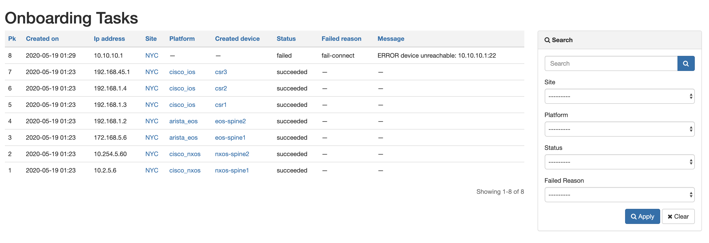
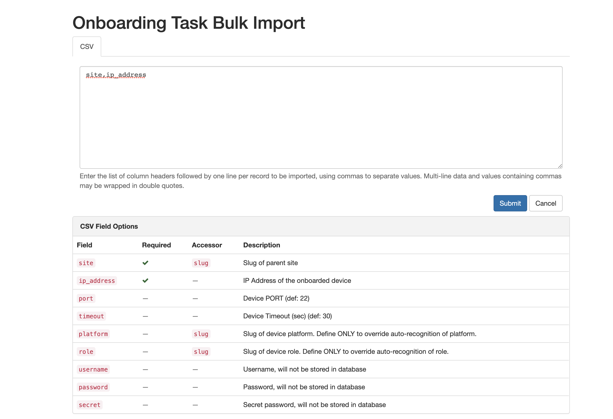
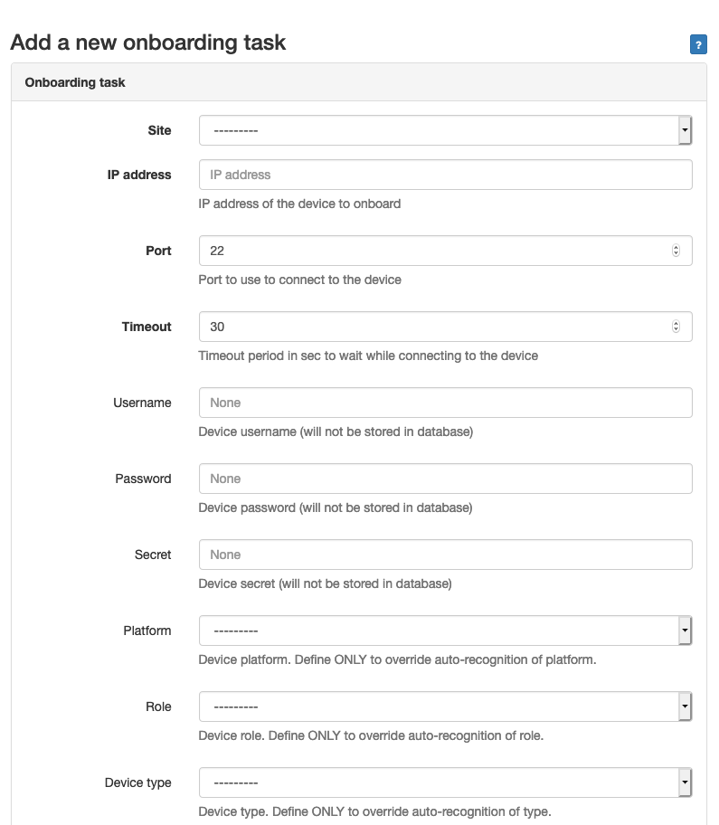
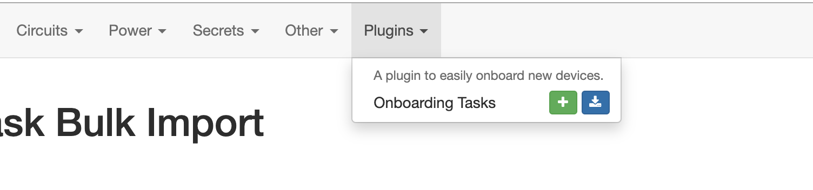

# NetBox Onboarding plugin

<!-- Build status with linky to the builds for ease of access. -->
[](https://travis-ci.com/networktocode/ntc-netbox-plugin-onboarding)

A plugin for [NetBox](https://github.com/netbox-community/netbox) to easily onboard new devices.

`ntc-netbox-plugin-onboarding` is using [Netmiko](https://github.com/ktbyers/netmiko), [NAPALM](https://napalm.readthedocs.io/en/latest/) & [Django-RQ](https://github.com/rq/django-rq) to simplify the onboarding process of a new device into NetBox down to an IP Address and a site.
The goal of this plugin is not to import everything about a device into NetBox but rather to help build quickly an inventory in NetBox that is often the first step into an automation journey.

## Installation

If using the installation pattern from the NetBox Documentation, you will need to activate the
virtual environment before installing so that you install the package into the virtual environment.

```shell
cd /opt/netbox
source venv/bin/activate
```

The plugin is available as a Python package in pypi and can be installed with pip. Once the
installation is completed, then NetBox and the NetBox worker must be restarted.

```shell
pip install ntc-netbox-plugin-onboarding
systemctl restart netbox netbox-rq
```

### Compatibility Matrix

|                       | Netbox 2.8 | Netbox 2.9 | Netbox 2.10 | Netbox 2.11 |
|-----------------------|------------|------------|-------------|-------------|
| Onboarding Plugin 1.3 |      X     |            |             |             |
| Onboarding Plugin 2.0 |      X     |      X     |             |             |
| Onboarding Plugin 2.1 |      X     |      X     |      X      |             |
| Onboarding Plugin 2.2 |      X     |      X     |      X      |      X      |

To ensure NetBox Onboarding plugin is automatically re-installed during future upgrades, create a file named `local_requirements.txt` (if not already existing) in the NetBox root directory (alongside `requirements.txt`) and list the `ntc-netbox-plugin-onboarding` package:

```no-highlight
# echo ntc-netbox-plugin-onboarding >> local_requirements.txt
```

Once installed, the plugin needs to be enabled in your `configuration.py`
```python
# In your configuration.py
PLUGINS = ["netbox_onboarding"]

# PLUGINS_CONFIG = {
#   "netbox_onboarding": {
#     ADD YOUR SETTINGS HERE
#   }
# }
```

Finally, make sure to run the migrations for this plugin

```bash
python3 manage.py migrate
```

The plugin behavior can be controlled with the following list of settings

- `create_platform_if_missing` boolean (default True), If True, a new platform object will be created if the platform discovered by netmiko do not already exist and is in the list of supported platforms (`cisco_ios`, `cisco_nxos`, `arista_eos`, `juniper_junos`, `cisco_xr`)
- `create_device_type_if_missing` boolean (default True), If True, a new device type object will be created if the model discovered by Napalm do not match an existing device type.
- `create_manufacturer_if_missing` boolean (default True), If True, a new manufacturer object will be created if the manufacturer discovered by Napalm is do not match an existing manufacturer, this option is only valid if `create_device_type_if_missing` is True as well.
- `create_device_role_if_missing` boolean (default True), If True, a new device role object will be created if the device role provided was not provided as part of the onboarding and if the `default_device_role` do not already exist.
- `create_management_interface_if_missing` boolean (default True), If True, add management interface and IP address to the device. If False no management interfaces will be created, nor will the IP address be added to NetBox, while the device will still get added.
- `default_device_status` string (default "active"), status assigned to a new device by default (must be lowercase).
- `default_device_role` string (default "network")
- `default_device_role_color` string (default FF0000), color assigned to the device role if it needs to be created.
- `default_management_interface` string (default "PLACEHOLDER"), name of the management interface that will be created, if one can't be identified on the device.
- `default_management_prefix_length` integer ( default 0), length of the prefix that will be used for the management IP address, if the IP can't be found.
- `skip_device_type_on_update` boolean (default False), If True, an existing NetBox device will not get its device type updated. If False, device type will be updated with one discovered on a device.
- `skip_manufacturer_on_update` boolean (default False), If True, an existing NetBox device will not get its manufacturer updated. If False, manufacturer will be updated with one discovered on a device.
- `platform_map` (dictionary), mapping of an **auto-detected** Netmiko platform to the **NetBox slug** name of your Platform. The dictionary should be in the format:
    ```python
    {
      <Netmiko Platform>: <NetBox Slug>
    }
    ```
- `onboarding_extensions_map` (dictionary), mapping of a NAPALM driver name to the loadable Python module used as an onboarding extension. The dictionary should be in the format:
    ```python
    {
      <Napalm Driver Name>: <Loadable Python Module>
    }
    ```
- `object_match_strategy` (string), defines the method for searching models. There are
currently two strategies, strict and loose. Strict has to be a direct match, normally 
using a slug. Loose allows a range of search criteria to match a single object. If multiple
objects are returned an error is raised. 

## Upgrades

When a new release comes out it may be necessary to run a migration of the database to account for any changes in the data models used by this plugin. Execute the command `python3 manage.py migrate`from the NetBox install `netbox/` directory after updating the package.

## Usage

### Preparation

To properly onboard a device, the plugin needs to only know the Site as well as device's primary IP address or DNS Name.

> For DNS Name Resolution to work, the instance of NetBox must be able to resolve the name of the
> device to IP address.

Providing other attributes (`Platform`, `Device Type`, `Device Role`) is optional - if any of these attributes is provided, plugin will use provided value for the onboarded device.
If `Platform`, `Device Type` and/or `Device Role` are not provided, the plugin will try to identify these information automatically and, based on the settings, it can create them in NetBox as needed.
> If the Platform is provided, it must point to an existing NetBox Platform. NAPALM driver of this platform will be used only if it is defined for the platform in NetBox.
> To use a preferred NAPALM driver, either define it in NetBox per platform or in the plugins settings under `platform_map`

### Onboard a new device

A new device can be onboarded via :
- A web form  `/plugins/onboarding/add/`
- A CSV form to import multiple devices in bulk. `/plugins/onboarding/import/`
- An API, `POST /api/plugins​/onboarding​/onboarding​/`

During a successful onboarding process, a new device will be created in NetBox with its management interface and its primary IP assigned. The management interface will be discovered on the device based on the IP address provided.

> By default, the plugin is using the credentials defined in the main `configuration.py` for Napalm (`NAPALM_USERNAME`/`NAPALM_PASSWORD`). It's possible to define specific credentials for each onboarding task.

### Consult the status of onboarding tasks

The status of the onboarding process for each device is maintained is a dedicated table in NetBox and can be retrived :
- Via the UI `/plugins/onboarding/`
- Via the API `GET /api/plugins​/onboarding​/onboarding​/`

### API

The plugin includes 4 API endpoints to manage the onbarding tasks

```shell
GET        /api/plugins​/onboarding​/onboarding​/       Check status of all onboarding tasks.
POST    ​   /api/plugins​/onboarding​/onboarding​/       Onboard a new device
GET     ​   /api/plugins​/onboarding​/onboarding​/{id}​/  Check the status of a specific onboarding task
DELETE    ​ /api/plugins​/onboarding​/onboarding​/{id}​/  Delete a specific onboarding task
```

## Contributing

Pull requests are welcomed and automatically built and tested against multiple version of Python and multiple version of NetBox through TravisCI.

The project is packaged with a light development environment based on `docker-compose` to help with the local development of the project and to run the tests within TravisCI.

The project is following Network to Code software development guideline and is leveraging:
- Black, Pylint, Bandit and pydocstyle for Python linting and formatting.
- Django unit test to ensure the plugin is working properly.

### CLI Helper Commands

The project is coming with a CLI helper based on [invoke](http://www.pyinvoke.org/) to help setup the development environment. The commands are listed below in 3 categories `dev environment`, `utility` and `testing`. 

Each command can be executed with `invoke <command>`. All commands support the arguments `--netbox-ver` and `--python-ver` if you want to manually define the version of Python and NetBox to use. Each command also has its own help `invoke <command> --help`

#### Local dev environment
```
  build            Build all docker images.
  debug            Start NetBox and its dependencies in debug mode.
  destroy          Destroy all containers and volumes.
  start            Start NetBox and its dependencies in detached mode.
  stop             Stop NetBox and its dependencies.
```

#### Utility 
```
  cli              Launch a bash shell inside the running NetBox container.
  create-user      Create a new user in django (default: admin), will prompt for password.
  makemigrations   Run Make Migration in Django.
  nbshell          Launch a nbshell session.
```
#### Testing 

```
  tests            Run all tests for this plugin.
  pylint           Run pylint code analysis.
  pydocstyle       Run pydocstyle to validate docstring formatting adheres to NTC defined standards.
  bandit           Run bandit to validate basic static code security analysis.
  black            Run black to check that Python files adhere to its style standards.
  unittest         Run Django unit tests for the plugin.
```

## Questions

For any questions or comments, please check the [FAQ](FAQ.md) first and feel free to swing by the [Network to Code slack channel](https://networktocode.slack.com/) (channel #networktocode).
Sign up [here](http://slack.networktocode.com/)

## Screenshots

List of Onboarding Tasks


CSV form to import multiple devices


Onboard a single device


Menu 


